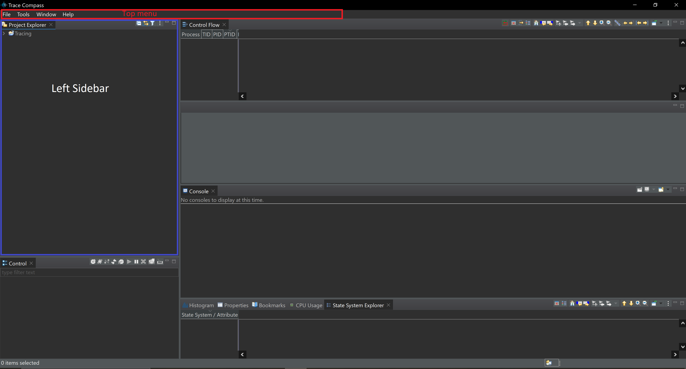
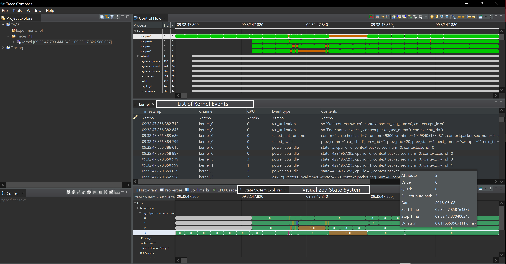

## Overview

The **Trace Abstraction and Analysis Framework (TAAF)** turns massive, low-level kernel traces into concise, accurate answers by combining three pillars:

* **State System** – Trace Compass’s time-indexed database that stores every CPU, thread, and value as efficiently searchable intervals.
* **Knowledge Graph (KG)** – A query-specific, JSON graph distilled from the State System slice and enriched with structure and metrics.
* **Large Language Model (LLM)** – A reasoning model that reads the KG and returns a natural-language explanation grounded in trace facts.

* 
This replication package shows how to reproduce every step of the TAAF workflow:

1. **Import traces & build the State System** – Load raw LTTng or Perfetto files into Eclipse Trace Compass and construct a State System that indexes all events by time.
2. **Extract a time-windowed State slice** – Use built-in EASE scripts to pull only the intervals relevant to the user’s question or benchmark window.
3. **Generate a knowledge graph** – Run `cpu_usage_graph_generator.py` to convert the extracted slice into a compact, query-specific JSON KG.
4. **Ask the LLM** – Open the Colab notebook, supply the KG and a plain-English question, and receive a grounded answer with supporting evidence.
5. **Reproduce the experiments** – Execute the 100-question benchmark with the provided model presets and scoring scripts to match the paper’s accuracy and consistency results.
6. **Extend or adapt** – Swap in new traces, change window lengths, tweak KG builders, or test alternative LLMs without touching the core pipeline.

## Folder layout

```text
TAAF-LLM-KG-State-System-/
├── raw_trace_data/                 # ✱ IMPORT THIS into Trace Compass
│   └── scimark2-all-events-run0/   #   Original LTTng CTF directory
│       └── kernel/
│           └── ...
│
├── trace_data/                     # Quick-peek CSV dump of the same run
│   └── run0_0.csv                  # Human-readable event data
│
├── ease_scripts/                   # Trace Compass State System query scripts
│   └── query2d.js                  # ★ Main EASE script — picks a time window
│                                   #   & writes thread/CPU intervals to stdout
│
├── cpu_usage/
│   ├── mid_1s.txt                  # State intervals (1s window) from mid trace
│   ├── mid_10s.txt                 # State intervals (10s window) from mid trace
│   ├── mid_100s.txt                # State intervals (100s window) from mid trace
│   ├── start_10s.txt               # State intervals (10s window) from the start of trace
│   ├── end_10s.txt                 # State intervals (10s window) from the end of trace
│   ├── mid_1s.json                 # KG produced from mid_1s.txt
│   ├── mid_10s.json                # KG produced from mid_10s.txt
│   ├── mid_100s.json               # KG produced from mid_100s.txt
│   ├── start_10s.json              # KG produced from start_10s.txt
│   ├── end_10s.json                # KG produced from end_10s.txt
│   ├── cpu_usage_graph_generator.py # Creates KGs from the State System slices
│   └── graph_info_extractor.py     # Prints basic KG + TXT statistics
│
├── taaf.ipynb                      # MAIN COLAB NOTEBOOK: baseline vs. full TAAF
│
├── taaf.py                         # Main script (if used outside Colab)
│
├── test.py                         # Test script
│
├── evaluation/                     # Scripts that draw every figure in the paper
│   ├── RQ1.py … RQ7.py
│   └── …
│
├── evaluation_outputs/             # PNG/PDF results of the evaluation scripts
│   ├── RQ1-1.pdf
│   ├── RQ1-1.png
│   └── …
│
├── refrence_answers/               # Utilities to pull “ground-truth” answers
│   └── …
│
├── extra_documents/                # Slides, diagrams, logo, etc.
│   ├── readme_figures/
│   │   ├── addons.png
│   │   ├── create_project.png
│   │   ├── import1.png
│   │   ├── import2.png
│   │   ├── state_system_result.png
│   │   ├── state_system.png
│   │   └── welcome.png
│   ├── Evaluation Presentation.pptx
│   ├── Evaluation.pdf
│   ├── TAAF (LLM + KG + State System).xlsx
│   ├── TAAF Aggregated Results.csv
│   └── TAAF.png
│
├── requirements.txt                # Python dependencies
└── README.md                       # ← you are here

```

## Prerequisites

* JDK 11 or later
* Eclipse Trace Compass
* Trace Compass plug-ins (see next section)
* Python 3.9+ with `pip install -r requirements.txt`
* Google account for Colab
* OpenAI API key saved as `OPENAI_API_KEY`

## Step 1  Import trace data and build the State System

1. **Install Trace Compass**

   * Visit [https://eclipse.dev/tracecompass/](https://eclipse.dev/tracecompass/) and follow the platform-specific instructions to download Trace Compass.
   * After installation Trace Compass starts with its default workspace.
   * 

2. **Enable scripting add-ons**

   * Top menu → *Tools* → *Add-ons*.
   * Check the following items then press *Apply and Restart*:

     * Trace Compass Scripting (Incubation)
     * Trace Compass Scripting Javascript (Incubation)
     * Trace Compass Scripting Python (Incubation)
   * These add-ons let us query the State System interactively.
   * 

3. **Create a tracing project**

   * Left navigator → right-click → *New* → *Tracing Project*.
   * Enter the name **TAAF** and finish.
   * 

4. **Import the raw trace**

   * In the **TAAF** project open the *Traces [0]* folder.
   * Right-click → *Import Trace*.
   * Select `raw_trace_data/scimark2-all-events-run0/kernel` then click *Finish*.
   * Trace Compass parses events and builds the State System automatically.
   * Double-click the trace to open it in the main view.
   * 
   * 
   

5. **Open State System Explorer**

   * Top menu → *Window* → *Show View* → *State System Explorer*.
   * This view lets you inspect attributes, quarks and intervals.
   * 

6. **Run the EASE script**

   * Copy the entire `ease_scripts/` folder into the **TAAF** project.
   * In the navigator right-click `query2d.js` → *Run As* → *EASE Script*.
   * The script prints thread–CPU intervals for the chosen time window to the *Console* view.
   * 

7. **Save the console output**

   * Select all console text, copy it, and paste into a new file inside
     `cpu_usage/`.
   * The repository already contains five ready-made slices
     (`mid_1s.txt`, `mid_10s.txt`, `mid_100s.txt`, `start_10s.txt`, `end_10s.txt`)
     produced with this method.

You have now built the State System and extracted the numeric slice needed for the next step, Knowledge Graph construction.

## Step 2  Generate the knowledge graph

Each State-System slice (`*.txt`) can be transformed into a compact, query-specific Knowledge Graph (`*.json`).

1. **Pick a slice**
   Examples already included:

   | Slice           | Time window | Location        |
   | --------------- | ----------- | --------------- |
   | `mid_1s.txt`    | 1 s         | middle of trace |
   | `mid_10s.txt`   | 10 s        | middle          |
   | `mid_100s.txt`  | 100 s       | middle          |
   | `start_10s.txt` | 10 s        | trace start     |
   | `end_10s.txt`   | 10 s        | trace end       |

2. **Run the generator**

   ```bash
   cd TAAF-LLM-KG-State-System-
   python cpu_usage/cpu_usage_graph_generator.py \
       --input  cpu_usage/mid_1s.txt \
       --output cpu_usage/mid_1s.json
   ```

   The script

   * parses every “CPU ↔ Thread” interval,
   * creates typed nodes and weighted edges,
   * writes a minimal JSON Knowledge Graph ready for the LLM.

   *(You can pass `--window`, `--start`, or `--end` flags to override defaults.)*

3. **Verify or explore the output**

   ```bash
   python -m json.tool cpu_usage/mid_1s.json | head
   ```

   or open the file in any JSON viewer to see nodes, edges, and metrics.

> **Quick start:** all five slices listed above are already processed; the corresponding JSON graphs live in `cpu_usage/`. Regenerate them only if you change the window or trace.

---

After this step you now hold **both**
*raw State-System outputs* (`cpu_usage/*.txt`) **and**
*their Knowledge Graphs* (`cpu_usage/*.json`).

These pairs enable the next phase, where we evaluate the **baseline** configuration (LLM + State System) against the full **TAAF** stack (LLM + State System + KG) by asking trace-related questions and comparing the answers.

## Step 3  Run the `taaf.ipynb` notebook

1. **Open the notebook**

   * In Colab: File → Upload notebook → select `taaf.ipynb`
   * Or click “Open in Colab” from the GitHub file view.

2. **Install dependencies**
   Run the first cell to install the OpenAI client:

   ```python
   !pip install -q openai
   ```

3. **Provide your OpenAI key**
   Colab shows a “Secrets” pane (🔒 icon) in the left sidebar.

   * Add a secret named `YOUR_API_KEY` with your OpenAI API key.
   * The setup cell reads it via:

     ```python
     from google.colab import userdata
     client = OpenAI(api_key=userdata.get("YOUR_API_KEY"))
     ```

4. **Select your data slice and KG**
   At the top of the notebook adjust these paths:

   ```python
   RAW_PATH = "cpu_usage/mid_10s.txt"
   KG_PATH  = "cpu_usage/mid_10s.json"
   ```

   All five pre-computed slices (`mid_1s`, `mid_10s`, `mid_100s`, `start_10s`, `end_10s`) live under those folders.

5. **Ask your question**
   In the final cell, call:

   ```python
   full_analysis(
       "What is the total accumulated CPU time for thread 5130 on CPU 1?",
       kg_path=KG_PATH,
       raw_path=RAW_PATH
   )
   ```

   * By default this prints two answers side-by-side:
     * **Baseline**: LLM reasoning over the State System raw data only.
     * **TAAF**: LLM reasoning over the Knowledge Graph built from the State System slice.
   * You can also change the `model=` argument to any OpenAI-compatible endpoint (e.g. `"gpt-4o"`, `"o4-mini"`).

You’re all set—compare **baseline** vs. **TAAF** answers, swap slices or models, and explore your own trace questions!

---
## Troubleshooting

| Problem                    | Quick check                                                |
| -------------------------- | ---------------------------------------------------------- |
| State System not building  | Trace file must be a valid CTF folder                      |
| Colab cannot find `openai` | Re-run the first cell to reinstall                         |
| Empty KG output            | Ensure the input text file is copied without extra headers |

---

[1]: https://eclipse.dev/tracecompass/?utm_source=chatgpt.com "Trace Compass - The Eclipse Foundation"
[2]: https://archive.eclipse.org/tracecompass/doc/stable/org.eclipse.tracecompass.doc.user/Installation.html?utm_source=chatgpt.com "Trace Compass User Guide - Installation - Eclipse archive"
[3]: https://marketplace.eclipse.org/content/trace-compass/help?utm_source=chatgpt.com "How to install Trace Compass | Eclipse Plugins, Bundles and Products"
[4]: https://wiki.eclipse.org/CDT/summitecon2016?utm_source=chatgpt.com "CDT/summitecon2016 - Eclipsepedia"
[5]: https://wiki.eclipse.org/Google_Summer_of_Code_2015_Ideas?utm_source=chatgpt.com "Google Summer of Code 2015 Ideas - Eclipsepedia"
[6]: https://colab.research.google.com/github/Tanu-N-Prabhu/Python/blob/master/How_to_handle_JSON_in_Python%3F.ipynb?utm_source=chatgpt.com "How to handle JSON in Python?.ipynb - Colab"
[7]: https://www.youtube.com/watch?v=LhhhxGpsY3c&utm_source=chatgpt.com "How to Upload and Open Jupyter Notebook (.ipynb) File in Google ..."
[8]: https://stackoverflow.com/questions/60366158/how-to-access-uploaded-json-file-google-colab?utm_source=chatgpt.com "How to access uploaded json file google colab - Stack Overflow"
[9]: https://colab.research.google.com/github/langfuse/langfuse-docs/blob/main/cookbook/integration_openai_sdk.ipynb?utm_source=chatgpt.com "Cookbook: OpenAI Integration (Python) - Colab"
[10]: https://github.com/eclipse-tracecompass/org.eclipse.tracecompass/blob/master/DEVELOPMENT_ENV_SETUP.md?utm_source=chatgpt.com "org.eclipse.tracecompass/DEVELOPMENT_ENV_SETUP.md at ..."
[11]: https://stackoverflow.com/questions/25428538/install-trace-compass-eclipse-plugin?utm_source=chatgpt.com "Install Trace compass Eclipse plugin - Stack Overflow"

## Evaluation Benchmark: TraceQA-100

Despite progress in using AI and LLMs for trace analysis, the community has lacked a public, ground-truth dataset for reasoning over kernel-level execution traces. Existing LLM benchmarks such as MMLU or Big-Bench do not address the unique challenges of trace analysis, including fine-grained time, multi-entity interactions, and numeric aggregation. To fill this gap, we introduce **TraceQA-100**, a curated benchmark designed to exercise all three dimensions.

**Trace provenance and slicing:**
TraceQA-100 uses LTTng traces of the SciMark 2.0 Java benchmark, which generates approximately 34 million kernel events. From each run, we extract 1s, 10s, and 100s slices around three canonical temporal locations (start, mid, and end), yielding a pool of trace segments that serve as the factual basis for question construction.

**Question authorship:**
Questions were generated through a four-step, double-blind process. Two experts independently inspected trace slices and drafted questions requiring time-aware, multi-entity reasoning. Drafts were peer-reviewed and normalized into three answer formats: explanatory, multiple-choice, or true/false. A third expert, blind to the drafts, produced reference answers using hand-written Trace Compass scripts; disagreements were resolved through adjudication. Each question was then tagged as single-hub or multi-hub based on the reasoning scope.

The resulting set includes an even 40/30/30 split across the three answer types and a 50/50 split across hub scopes. Since each prompt is instantiated on nine distinct trace slices (3 temporal locations × 3 time-window lengths), the benchmark comprises 100 × 9 = 900 unique question–trace-segment pairs.

**Access:**
TraceQA-100, our benchmark for evaluation, is available anonymously at: [ANONYMOUS_BENCHMARK_LINK]
