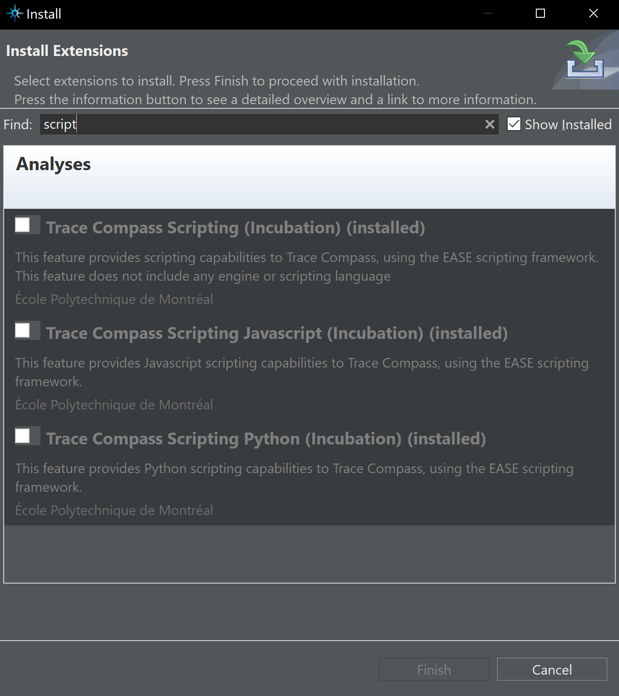

## Overview

The **Trace Abstraction and Analysis Framework (TAAF)** turns massive, low-level kernel traces into concise, accurate answers by combining three pillars:

* **State System** – Trace Compass’s time-indexed database that stores every CPU, thread, and value as efficiently searchable intervals.
* **Knowledge Graph (KG)** – A query-specific, JSON graph distilled from the State System slice and enriched with structure and metrics.
* **Large Language Model (LLM)** – A reasoning model that reads the KG and returns a natural-language explanation grounded in trace facts.

* 
This replication package shows how to reproduce every step of the TAAF workflow:

1. **Import traces & build the State System** – Load raw LTTng or Perfetto files into Eclipse Trace Compass and construct a State System that indexes all events by time.
2. **Extract a time-windowed State slice** – Use built-in EASE scripts to pull only the intervals relevant to the user’s question or benchmark window.
3. **Generate a knowledge graph** – Run `cpu_usage_graph_generator.py` to convert the extracted slice into a compact, query-specific JSON KG.
4. **Ask the LLM** – Open the Colab notebook, supply the KG and a plain-English question, and receive a grounded answer with supporting evidence.
5. **Reproduce the experiments** – Execute the 100-question benchmark with the provided model presets and scoring scripts to match the paper’s accuracy and consistency results.
6. **Extend or adapt** – Swap in new traces, change window lengths, tweak KG builders, or test alternative LLMs without touching the core pipeline.

## Folder layout

```text
taaf-replication-package/
├── raw_trace_data/                 # ✱ IMPORT THIS into Trace Compass
│   └── scimark2-all-events-run0/   #   Original LTTng CTF directory
│       └── …                       #   (replace with your own trace if desired)
│
├── trace_data/                     # Quick-peek CSV dump of the same run
│   └── run0_0.csv                  # Human-readable event data
│
├── ease_scripts/                   # Trace Compass State System query scripts
│   ├── script_examples/            # Tiny demos that show how to probe the
│   │   └── *.js                    #   State System, quarks, attributes …
│   └── query2d.js                  # ★ Main EASE script — picks a time window
│                                   #   & writes thread/CPU intervals to stdout
│
├── cpu_usage/
│   ├── state_system_data/          # Output of query2d.js for our study
│   │   ├── mid_1s.txt              # State intervals (1s window) from mid trace
│   │   ├── mid_10s.txt             # State intervals (10s window) from mid trace
│   │   ├── mid_100s.txt            # State intervals (100s window) from mid trace
│   │   ├── start_10s.txt           # State intervals (10s window) from the start of trace
│   │   └── end_10s.txt             # State intervals (10s window) from the end of trace
│   ├── knowledge_graph_data/       # KGs produced from the *.txt slices
│   │   ├── mid_1s.json
│   │   ├── mid_10s.json
│   │   ├── mid_100s.json
│   │   ├── start_10s.json
│   │   └── end_10s.json
│   ├── cpu_usage_graph_generator.py # Creates KGs from the State System slices
│   └── graph_info_extractor.py     # Prints basic KG + TXT statistics
│
├── taaf.ipynb                      # MAIN COLAB NOTEBOOK: baseline vs. full TAAF
│
├── evaluation/                     # Scripts that draw every figure in the paper
│   ├── RQ1.py … RQ7.py
│   └── …
│
├── evaluation_output/              # PNG/SVG results of the evaluation scripts
│   ├── RQ1.png
│   └── …
│
├── reference_answers/              # Utilities to pull “ground-truth” answers
│   └── …
│
├── extra_documents/                # Slides, diagrams, logo, etc.
│   └── …
└── README.md                       # ← you are here

```

## Prerequisites

* JDK 11 or later
* Eclipse IDE 2024-XX or newer
* Trace Compass plug-ins (see next section)
* Python 3.9+ with `pip install -r requirements.txt`
* Google account for Colab
* OpenAI API key saved as `OPENAI_API_KEY`

## Step 1  Import trace data and build the State System

1. **Install Trace Compass**

   * Visit [https://eclipse.dev/tracecompass/](https://eclipse.dev/tracecompass/) and follow the platform-specific instructions to download Tracecompass.
   * After installation Trace Compass starts with its default workspace.
   * 

2. **Enable scripting add-ons**

   * Top menu → *Tools* → *Add-ons*.
   * Check the following items then press *Apply and Restart*:

     * Trace Compass Scripting (Incubation)
     * Trace Compass Scripting Javascript (Incubation)
     * Trace Compass Scripting Python (Incubation)
   * These add-ons let us query the State System interactively.
   * 

3. **Create a tracing project**

   * Left navigator → right-click → *New* → *Tracing Project*.
   * Enter the name **TAAF** and finish.
   * 

4. **Import the raw trace**

   * In the **TAAF** project open the *Traces \[0]* folder.
   * Right-click → *Import Trace*.
   * Select `raw_trace_data/scimark2-all-events-run0/kernel` then click *Finish*.
   * Trace Compass parses events and builds the State System automatically.
   * Double-click the trace to open it in the main view.
   * 
   * 
   

5. **Open State System Explorer**

   * Top menu → *Window* → *Show View* → *State System Explorer*.
   * This view lets you inspect attributes, quarks and intervals.
   * 

6. **Run the EASE script**

   * Copy the entire `ease_scripts/` folder into the **TAAF** project.
   * In the navigator right-click `query2d.js` → *Run As* → *EASE Script*.
   * The script prints thread–CPU intervals for the chosen time window to the *Console* view.
   * 

7. **Save the console output**

   * Select all console text, copy it, and paste into a new file inside
     `cpu_usage/state_system_data/`.
   * The repository already contains five ready-made slices
     (`mid_1s.txt`, `mid_10s.txt`, `mid_100s.txt`, `start_10s.txt`, `end_10s.txt`)
     produced with this method.

You have now built the State System and extracted the numeric slice needed for the next step, Knowledge Graph construction.

## Step 2  Generate the knowledge graph

Each State-System slice (`*.txt`) can be transformed into a compact, query-specific Knowledge Graph (`*.json`).

1. **Pick a slice**
   Examples already included:

   | Slice           | Time window | Location        |
   | --------------- | ----------- | --------------- |
   | `mid_1s.txt`    | 1 s         | middle of trace |
   | `mid_10s.txt`   | 10 s        | middle          |
   | `mid_100s.txt`  | 100 s       | middle          |
   | `start_10s.txt` | 10 s        | trace start     |
   | `end_10s.txt`   | 10 s        | trace end       |

2. **Run the generator**

   ```bash
   cd taaf-replication-package
   python cpu_usage/cpu_usage_graph_generator.py \
       --input  cpu_usage/state_system_data/mid_1s.txt \
       --output cpu_usage/knowledge_graph_data/mid_1s.json
   ```

   The script

   * parses every “CPU ↔ Thread” interval,
   * creates typed nodes and weighted edges,
   * writes a minimal JSON Knowledge Graph ready for the LLM.

   *(You can pass `--window`, `--start`, or `--end` flags to override defaults.)*

3. **Verify or explore the output**

   ```bash
   python -m json.tool cpu_usage/knowledge_graph_data/mid_1s.json | head
   ```

   or open the file in any JSON viewer to see nodes, edges, and metrics.

> **Quick start:** all five slices listed above are already processed; the corresponding JSON graphs live in `cpu_usage/knowledge_graph_data/`. Regenerate them only if you change the window or trace.

---

After this step you now hold **both**
*raw State-System outputs* (`cpu_usage/state_system_data/*.txt`) **and**
*their Knowledge Graphs* (`cpu_usage/knowledge_graph_data/*.json`).

These pairs enable the next phase, where we evaluate the **baseline** configuration (LLM + State System) against the full **TAAF** stack (LLM + State System + KG) by asking trace-related questions and comparing the answers.

## Step 4  Execute the Colab notebook

1. Open **TAAF\_(LLM\_+*KG*+\_State\_Syst).ipynb** in Google Colab. Drag the file into Colab or open it from GitHub UI. ([youtube.com][7])
2. Upload `cpu_usage_input.txt` and `cpu_usage_graph.json` to the Colab session or mount Google Drive. ([stackoverflow.com][8])
3. Enter your OpenAI key in *Colab > Settings > Secrets* or run

```python
import os, getpass
os.environ["OPENAI_API_KEY"] = getpass.getpass()
```

4. Run the installation cell. It installs `openai` automatically. ([colab.research.google.com][9])
5. In the main cell call

```python
full_analysis("What is the total accumulated CPU time for thread 5130 on CPU 1?")
```

The notebook prints two answers. The second answer uses the KG. You can switch models or choose baseline mode by editing the arguments at the top of the notebook.

## Advanced notes

* Developers can replicate Trace Compass builds by following the environment guide on GitHub. ([github.com][10])
* Users who prefer older versions can install the plug-ins from the Stack Overflow instructions. ([stackoverflow.com][11])

## Troubleshooting

| Problem                    | Quick check                                                |
| -------------------------- | ---------------------------------------------------------- |
| State System not building  | Trace file must be a valid CTF folder                      |
| Colab cannot find `openai` | Re-run the first cell to reinstall                         |
| Empty KG output            | Ensure the input text file is copied without extra headers |

## License

This replication package is distributed under the MIT License.

---

[1]: https://eclipse.dev/tracecompass/?utm_source=chatgpt.com "Trace Compass - The Eclipse Foundation"
[2]: https://archive.eclipse.org/tracecompass/doc/stable/org.eclipse.tracecompass.doc.user/Installation.html?utm_source=chatgpt.com "Trace Compass User Guide - Installation - Eclipse archive"
[3]: https://marketplace.eclipse.org/content/trace-compass/help?utm_source=chatgpt.com "How to install Trace Compass | Eclipse Plugins, Bundles and Products"
[4]: https://wiki.eclipse.org/CDT/summitecon2016?utm_source=chatgpt.com "CDT/summitecon2016 - Eclipsepedia"
[5]: https://wiki.eclipse.org/Google_Summer_of_Code_2015_Ideas?utm_source=chatgpt.com "Google Summer of Code 2015 Ideas - Eclipsepedia"
[6]: https://colab.research.google.com/github/Tanu-N-Prabhu/Python/blob/master/How_to_handle_JSON_in_Python%3F.ipynb?utm_source=chatgpt.com "How to handle JSON in Python?.ipynb - Colab"
[7]: https://www.youtube.com/watch?v=LhhhxGpsY3c&utm_source=chatgpt.com "How to Upload and Open Jupyter Notebook (.ipynb) File in Google ..."
[8]: https://stackoverflow.com/questions/60366158/how-to-access-uploaded-json-file-google-colab?utm_source=chatgpt.com "How to access uploaded json file google colab - Stack Overflow"
[9]: https://colab.research.google.com/github/langfuse/langfuse-docs/blob/main/cookbook/integration_openai_sdk.ipynb?utm_source=chatgpt.com "Cookbook: OpenAI Integration (Python) - Colab"
[10]: https://github.com/eclipse-tracecompass/org.eclipse.tracecompass/blob/master/DEVELOPMENT_ENV_SETUP.md?utm_source=chatgpt.com "org.eclipse.tracecompass/DEVELOPMENT_ENV_SETUP.md at ..."
[11]: https://stackoverflow.com/questions/25428538/install-trace-compass-eclipse-plugin?utm_source=chatgpt.com "Install Trace compass Eclipse plugin - Stack Overflow"
